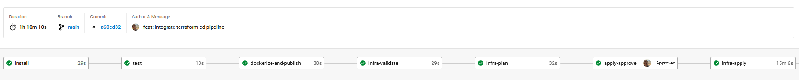
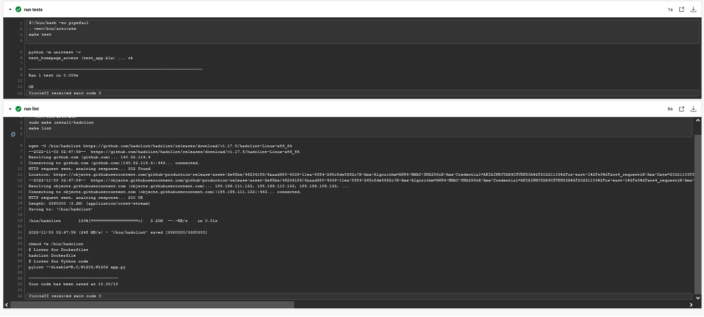
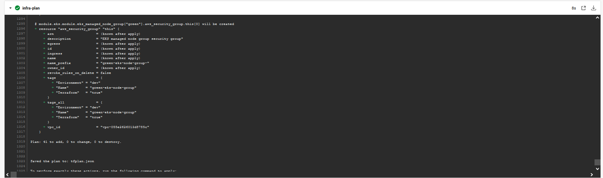
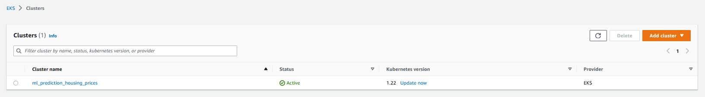
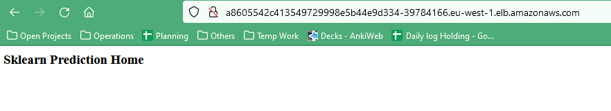

# operationalizing_ml_microservice

# Project summary
The goal of the project was to to operationalize a machine learning microservice for production. 
For that, I provisioned the automated pipeline where:
- CI pipeline executes static code analysis, linting, testing, and dockerization
- CD pipeline executes blue-green deployment into AWS EKS Kubernetes Service via Terraform.

The machine learning app itself is pretrained model  
predicting housing prices in Boston based on certain input features 
such as average rooms in a home and data about highway access, and so on.

## Prerequisites
The setup has the following prerequisites:
- CircleCI account integrated with the code repository
- DockerHub account, with repository name configured configured in CircleCI environment variables 
- AWS account and corresponding IAM user with deployment rights, with secret keys configured in CircleCI environment variables 
- S3 bucket to keep the terraform state, configured in 'config/dev_backend.tfvars'
- DynamoDB table to keep the terraform lock, configured in 'config/dev_backend.tfvars'

## Pipeline screens

# Running the app locally on linux
The following steps describes how to run the app on linux.

## Setting up the environment
1. Create a python virtual environment and activate it
- `python3 -m venv ~/.ml_microservice_env`
- `source ~/.ml_microservice_env/bin/activate`
2. Run `make install` to install dependencies
3. Install other libraries (if not already installed)
- Docker
- Hadolint
- Kubernetes (Minikube)

You can verify the installation of Docker and Kubernetes (Minikube) 
by checking the version of the libary
- `docker --version`
- `kubectl version`

## Running the app

1. Build and start docker container: 
Run `./run_docker.sh` 
Verify its proper deployment by running `/.make_prediction` from separate command line.

    
2. Run it in Kubernetes: 
To start a local cluster, type the terminal command: `minikube start` 
After minikube starts, a cluster should be running locally. 
You can check that you have one cluster running by typing `kubectl config view` 
where you should see at least one cluster with a certificate-authority and server.  
Then deploy the the app on kubernetes cluster by running `./run_kubernetes.sh`  
Initially, your pod may be in the process of being created,  
as indicated by STATUS: ContainerCreating, but you just have to wait a few minutes until the pod is ready, 
then you can run the script again.  
You can check on your pod’s status with a call to `kubectl get pod`  
and you should see the status change to Running. Then you can run again `./run_kubernetes.sh`.  
Verify its proper deployment by running `/.make_prediction` from separate command line. 
